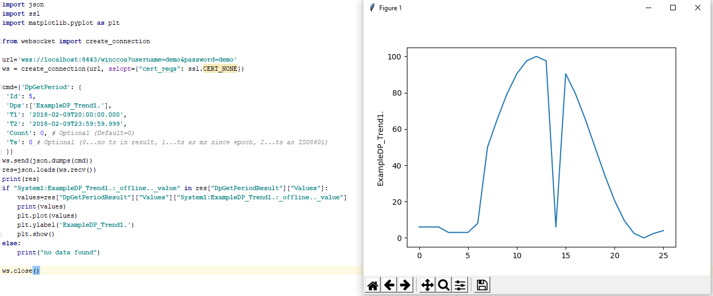

# Websocket Server for WinCC OA

Connect programs (e.g. Python Program) to WinCC OA through a Websocket Manager. Communication is JSON based, it’s simple to use with Python, see the Jupyter Notebook example [Jupyter Notebook](https://github.com/vogler75/oa4j-wss/blob/master/src/python/notebook.ipynb) and the examples below. dpGet, dpSet, dpConnect, dpQueryConnect, dpGetPeriod, ... more functions may come...
<br>

# Server Setup
oa4j is needed: https://rocworks.at/oa4j<br>
Copy WCCOAjava.exe to \<project\>\bin directory<br>
Copy WCCOAjava.dll to \<project\>\bin directory<br>
Install java runtime: https://java.com/de/download/<br>
Add C:\Program Files\Java\jre1.8.0_161\bin\server to PATH environment variable<br>
<br>
# Build Websocket Server
You need [Maven](https://dlcdn.apache.org/maven/maven-3/3.8.8/binaries/apache-maven-3.8.8-bin.zip) and Java.
> make.bat

copy wss\wss.jar to \<project\>\bin directory  
copy wss\keystore.jks to \<project\>  
copy lib directory to your \<project\>\lib directory
<br>
Add the following lines to your config file. Copy the paths ffrom the classpath.txt file. This file is created during the build.
```
[java]
classPath = "bin;bin/wss-1.0-SNAPSHOT.jar;lib/winccoa-java-1.0-SNAPSHOT.jar;lib/graphql-java-12.0.jar;lib/antlr4-runtime-4.7.2.jar;lib/slf4j-api-1.7.25.jar;lib/java-dataloader-2.1.1.jar;lib/reactive-streams-1.0.2.jar;lib/gson-2.8.2.jar;lib/websocket-server-9.4.8.v20171121.jar;lib/websocket-common-9.4.8.v20171121.jar;lib/websocket-api-9.4.8.v20171121.jar;lib/jetty-util-9.4.8.v20171121.jar;lib/jetty-io-9.4.8.v20171121.jar;lib/websocket-client-9.4.8.v20171121.jar;lib/jetty-client-9.4.8.v20171121.jar;lib/jetty-xml-9.4.8.v20171121.jar;lib/websocket-servlet-9.4.8.v20171121.jar;lib/javax.servlet-api-3.1.0.jar;lib/jetty-servlet-9.4.8.v20171121.jar;lib/jetty-security-9.4.8.v20171121.jar;lib/jetty-server-9.4.8.v20171121.jar;lib/jetty-http-9.4.8.v20171121.jar;lib/rxjava-1.3.5.jar"

```
Add a WCCOAjava manager to your project: -num 1 -cp bin/wss.jar -c wss/Server<br>
  
# Python Examples
see pyhton-client-example.py & python-client-plot.py!


## Open Connection
```
import json
import ssl
from websocket import create_connection
url='wss://rocworks.no-ip.org:80/winccoa?username=demo&password=demo'
ws = create_connection(url, sslopt={"cert_reqs": ssl.CERT_NONE})
```
## dpGetPeriod
```
cmd={'DpGetPeriod': {
 'Id': 1,
 'Dps':['ExampleDP_Trend1.'],
 'T1': '2018-02-07T18:10:00.000', 
 'T2': '2018-02-07T23:59:59.999',
 'Count': 0, # Optional (Default=0)
 'Ts': 0 # Optional (0...no ts in result, 1...ts as ms since epoch, 2...ts as ISO8601, 3/4...ts/values in separate arrays (ms/iso))
 }}
ws.send(json.dumps(cmd))
res=json.loads(ws.recv())
#print(res)
if "System1:ExampleDP_Trend1.:_offline.._value" in res["DpGetPeriodResult"]["Values"]:
 values=res["DpGetPeriodResult"]["Values"]["System1:ExampleDP_Trend1.:_offline.._value"]
 print(values)
else:
 print("no data found")
 
{
    "DpGetPeriodResult": {
        "Error": 0,
        "Id": 1,
        "Values": {
            "System1:ExampleDP_Trend1.:_offline.._value": [
                6.0,
                6.0,
                6.0
            ]
        }
    }
}
```
## Plot result of dpGetPeriod
```
%matplotlib inline 
import matplotlib.pyplot as plt
plt.plot(values)
plt.ylabel('ExampleDP_Trend1.')
plt.show()
```
## dpGet
```
cmd={'DpGet': {'Id': 2, 'Dps':['ExampleDP_Trend1.', 'ExampleDP_Trend2.']}}
ws.send(json.dumps(cmd))
res=json.loads(ws.recv())
print(json.dumps(res, indent=4, sort_keys=True))
{
    "DpGetResult": {
        "Error": 0,
        "Id": 2,
        "Values": {
            "System1:ExampleDP_Trend1.:_original.._value": 6.0,
            "System1:ExampleDP_Trend2.:_original.._value": 6.0
        }
    }
}
```
## dpSet
```
from random import randint
cmd={'DpSet': {'Id': 3, 'Wait': True, 
 'Values':[{'Dp':'ExampleDP_Trend1.','Value': randint(0, 9)}, 
 {'Dp':'ExampleDP_Trend2.','Value': randint(0, 9)}]}}
ws.send(json.dumps(cmd))
res=json.loads(ws.recv())
print(json.dumps(res, indent=4, sort_keys=True))
{
    "Response": {
        "Code": 0,
        "Id": 3,
        "Message": ""
    }
}
```
## dpConnect
```
from threading import Thread

def read():
    while True:
        res=json.loads(ws.recv())
        print(res)
Thread(target=read).start()
    
cmd={"DpConnect": {"Id": 4, "Dps": ["ExampleDP_Trend1."]}}
ws.send(json.dumps(cmd))

{
    "DpConnectResult": {
        "Error": 0,
        "Id": 4,
        "Values": {
            "System1:ExampleDP_Trend1.:_online.._value": 6.0
        }
    }
}
```
## dpQueryConnect
```
cmd={'DpQueryConnect': {'Id': 5, 'Query':"SELECT '_online.._value' FROM 'ExampleDP_*.'", 'Answer': True}}
ws.send(json.dumps(cmd))
'''
{
    "DpQueryConnectResult": {
        "Error": 0,
        "Id": 5,
        "Header": [
            "",
            ":_online.._value"
        ],
        "Values": [
            [
                "System1:ExampleDP_Trend1.",
                6.0
            ]
        ]
    }
}
'''
```
